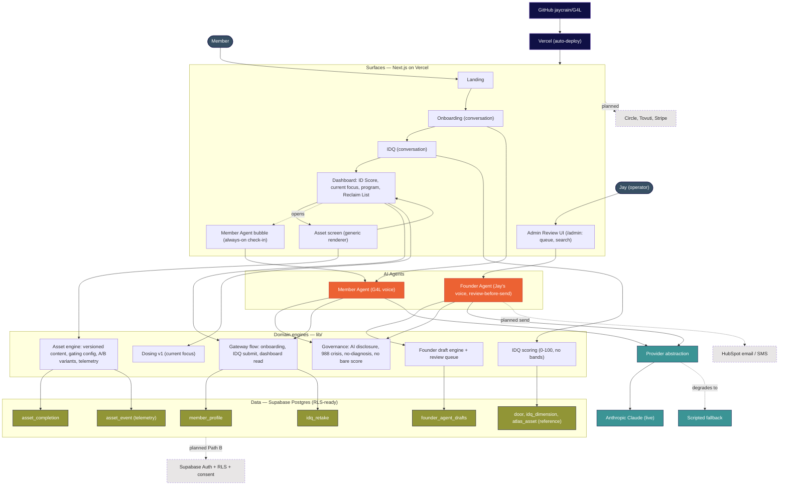

# G4L Platform — Architecture (as built)

What's running today, end to end. Solid boxes are **built and deployed**; dashed boxes are
**planned / not yet wired**. View this on GitHub (it renders the diagram), or paste the
Mermaid block into <https://mermaid.live> to export a PNG for a deck.

## How to read it
- **Two agents, two voices.** The **Member Agent** (G4L voice) powers onboarding and the
  always-on check-in bubble. The **Founder Agent** (Jay's voice) drafts correspondence for the
  admin review queue and never sends on its own.
- **Surfaces are thin; engines do the work.** Each screen calls framework-free engines in
  `lib/` (scoring, governance, gateway flow, dosing, asset engine, founder drafting), which is
  what makes the logic testable (53 passing tests) and portable.
- **One provider abstraction, graceful fallback.** Both agents talk to Anthropic Claude through
  one layer; if Claude is unreachable, they degrade to a scripted voice instead of failing.
- **One data layer, two backends.** The same SQL runs on local Postgres (pglite) in dev and
  hosted Supabase in production, selected by `DATABASE_URL`.
- **Governance is cross-cutting**, not a feature: AI disclosure, 988 crisis routing, no
  diagnosis, no bare score, and review-before-send on the Founder Agent.

## Built vs planned
- **Built & live:** all solid boxes — both agents, all member surfaces, the asset engine,
  the admin Review UI, telemetry, Supabase, Vercel auto-deploy.
- **Planned (dashed):** the HubSpot send rail, the Circle/Tovuti/Stripe integrations, and the
  Path-B security layer (Supabase Auth + row-level security + consent) required before real
  members. Multi-tenant (corporate instances) is architected-for but dormant.
